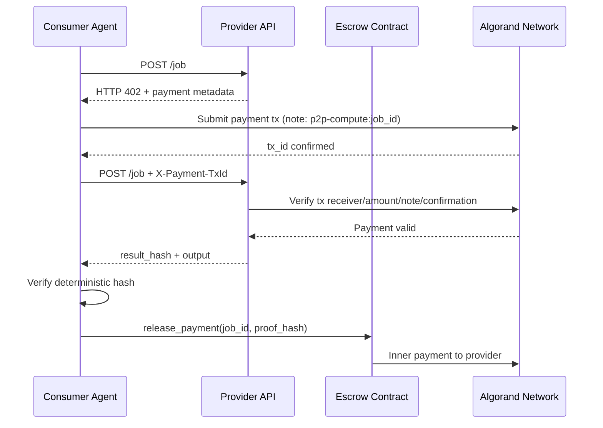

# P2P Compute Marketplace - Algorand Agentic Commerce

## What It Does
P2P Compute Marketplace is a decentralized campus compute exchange where provider nodes expose idle GPU or CPU resources and consumer agents autonomously purchase compute jobs. Instead of requiring a human to approve every payment, the consumer agent handles provider discovery, pricing checks, payment submission, output verification, and settlement.

The payment path follows an Algorand x402-style machine-to-machine model: provider API returns HTTP 402 with payment terms, the agent sends an Algorand payment transaction containing a job-bound note, and the provider validates it before executing the job. This turns API compute into pay-per-call, agent-operated commerce.

## Architecture


## Tech Stack
| Layer | Technology | Purpose |
|---|---|---|
| Smart contracts | Algorand Python (ARC-4) | Escrow, provider registry, badge contract |
| Backend API | FastAPI + Uvicorn | x402 middleware, job execution, telemetry |
| Agent | Python + algosdk | Autonomous payment, routing, verification |
| Frontend | React 18 + TypeScript + Vite | Live dashboards for providers, activity, tx logs |
| Wallets | @txnlab/use-wallet + algosdk | Human wallet connection + agent signing |

## Getting Started

### Prerequisites
- Python 3.11+
- Node 18+
- Docker
- AlgoKit CLI

### Installation
1. Clone the repository.
2. Copy `.env.example` to `.env` and fill keys.
3. Install backend dependencies: `pip install -e .`
4. Install frontend dependencies: `cd frontend && npm install`
5. Start LocalNet: `algokit localnet start`
6. Deploy contracts: `python contracts/deploy.py`
7. Fund demo accounts: `python scripts/fund_accounts.py`
8. Mint badges: `python scripts/mint_badges.py`

### Running The Demo
1. Start LocalNet: `algokit localnet start`
2. Deploy contracts: `python contracts/deploy.py`
3. Fund and prepare accounts: `python scripts/fund_accounts.py` and `python scripts/mint_badges.py`
4. Register provider: `python scripts/register_provider.py`
5. Start provider API: `uvicorn api.main:app --port 8000`
6. Start agent bridge: `uvicorn api.agent_bridge:app --port 3001`
7. Start frontend: `cd frontend && npm run dev`
8. Run agent flow: `python agent/consumer_agent.py --type inference --tokens 500 --payload "Algorand demo"`

## How It Maps To Algorand Agentic Commerce
This project demonstrates direct agentic payments where autonomous software decides when and how to pay for external services. The provider does not trust client intent and instead enforces payment first via HTTP 402 metadata, with on-chain verification gates before execution.

The marketplace supports machine-to-machine settlement, pay-per-call compute APIs, and autonomous retries or fallback logic. Each job can be verified by deterministic hashing and resolved by escrow release or refund behavior, aligning with trust-minimized agentic commerce patterns.

## Smart Contracts
| Contract | App ID | Purpose |
|---|---|---|
| EscrowContract | 1040 | Lock, release, refund job-linked funds |
| ProviderRegistry | 1005 | Provider listing, uptime metadata |
| BadgeMinter | 1013 | Campus membership soulbound badge |

## Live LocalNet Evidence
- LocalNet runtime: Docker on WSL Debian via `algokit localnet start`
- Latest successful autonomous run includes full escrow lifecycle:
  - Escrow lock tx: `SKOLJKAAC4VULG3HO5UYFZGQT5IHCBUY2VG6SNE6VUTFTNOLIOKQ`
  - x402 payment tx: `XVBKITBQCDWCEIHEYKZLIQZT3E2U22HRNX6M2CNPJDIITPEBJU2A`
  - Escrow release tx: `A2ASEHP5JRNAK5XPOP666565KEIVHILLVVBOT73ALDWM2G4NMC3A`
- Transaction confirmations observed on-chain in LocalNet rounds: 67, 68, 69.

## One-Command Demo (WSL)
Run this from WSL Debian at repo root:

```bash
algokit localnet start \
&& python3 contracts/deploy.py \
&& python3 scripts/fund_accounts.py \
&& python3 scripts/register_provider.py \
&& python3 scripts/mint_badges.py \
&& (python3 -m uvicorn api.main:app --host 0.0.0.0 --port 8000 >/tmp/provider.log 2>&1 &) \
&& sleep 3 \
&& python3 agent/consumer_agent.py --type inference --tokens 100 --payload "Algorand live demo"
```

## License
MIT
